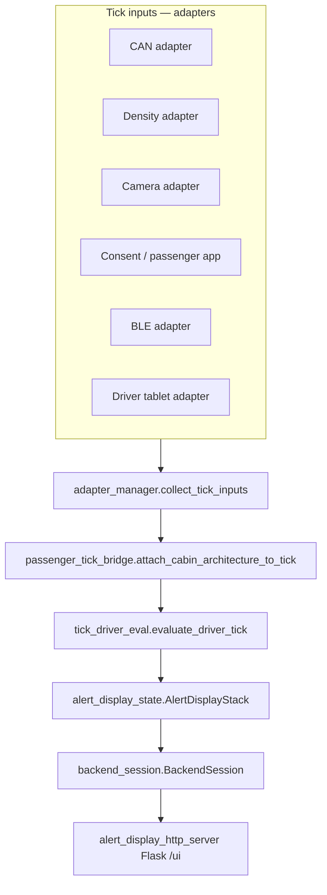

# TravelMate AI — Architecture & Operations Report

**Document type:** Customer-facing overview with engineering appendix  
**Software status:** Proof-of-concept (PoC) edge runtime  
**Audience:** Product stakeholders, safety reviewers, and software engineers onboarding to the codebase  
**Export:** This file is Markdown; open in VS Code / Word / Google Docs and **Print → Save as PDF** for a formal PDF deliverable.

---

## 1. Executive summary

TravelMate AI PoC simulates an **onboard edge assistant** that repeatedly evaluates cabin and vehicle context on a fixed **tick cadence**, produces **prioritized operational alerts** for the driver (and mirrored tablet UI), and handles **emergency-class signals** that require acknowledgment. The design separates:

1. **Inputs** — adapters assemble one structured **tick** dictionary per cycle (camera-derived cues, CAN-like motion/doors/ramp, density, consent categories, BLE, passenger/driver events).  
2. **Evaluation** — a single shared path (`evaluate_driver_tick`) applies scenario classification, risk arbitration, vulnerability inference, exit logic, and emergency policy.  
3. **Presentation** — `BackendSession` maintains a **stacked alert display**; optional **HTTP server** exposes the same stack to a tablet (`/ui`).  

**Room test mode** swaps slow demo cadence for fast validation, keeps **density** and **CAN** under explicit manual JSON control, and optionally drives **live OpenCV** perception (single or dual camera) with OpenCV preview windows.

**Important limitation:** Observed cues describe **situations and zones**, not diagnoses. Consent-declared **support categories** tune thresholds and routing; they are **not** inferred from vision alone (`observed_cues.py`, `thresholds.py`).

---

## 2. Product intent & priority passenger scenarios

The PoC emphasizes assistive, **non-accusatory** language (`driver_alert_text.py`) and operational requests (smoother driving, assistance at doors, bay clearance). The following **target groups** align with **consent categories** (`SupportCategory` in `thresholds.py`) and **perception cues** (`ObservedCues` in `observed_cues.py`):

| Stakeholder focus | Consent categories (examples) | Cue families the stack can use | Representative alert themes |
|------------------|------------------------------|--------------------------------|----------------------------|
| **Children** | `child_support` | `rapid_erratic_motion`, prolonged standing vs vehicle motion | `CHILD_HIGH_MOVEMENT`; motion/instability alerts when compounded with consent and vehicle dynamics |
| **Mobility aids (cane-style / guidance)** | `mobility_support`, `visual_impairment` | `navigation_aid_in_use`, behavioral gate fields on floor contact / gait coupling | Scenario candidates for movement + door / priority zones; medical-sensitivity branch can soften instability copy to **“Gentle speed — smoother braking.”** |
| **Wheelchair users** | `wheelchair` | `large_mobility_device_present`, `near_door_area`, `near_priority_space`, bay / posture instability | `WHEELCHAIR_UNSAFE_POSITION`, `WHEELCHAIR_UNSTABLE_IN_BAY`, `WHEELCHAIR_BAY_OBSTRUCTION`, `BLOCKED_EXIT_VULNERABLE` (with policy gates) |
| **Elderly / frailty-style motion** | `elderly_support` | `unstable_posture`, `leaning_without_support`, `frequent_balance_correction`, slow medical-collapse track | `INSTABILITY_RISK`, `STANDING_MOTION_RISK`, `VULNERABILITY_ASSISTANCE_ADVISORY`, exit-crowding assist |
| **Baby pushchairs** | `pushchair` | `small_wheeled_carriage_present`, instability / motion coupling | `PUSHCHAIR_UNSAFE_POSITION`, `PUSHCHAIR_INSTABILITY` |
| **General crowding / capacity** | Any | Density + cues | `CROWDING_ADVISORY`, `CAPACITY_EXCEEDED` |

**Design rule:** Alerts reference **passenger state (as modeled), zone context, and vehicle state** — not raw pixels. Dual-camera mode adds explicit `CameraObservation` rows and `PassengerWorld` continuity (Zone 2 → Zone 1) using **timing and cue presence**, not biometrics (`passenger_world.py`, `passenger_tick_bridge.py`).

---

## 3. End-to-end architecture



**Per tick (simplified):**

1. **Assemble tick** — `adapters/adapter_manager.py` calls each reader; merges room-test metadata; applies Phase‑1 cue mask if enabled.  
2. **Cabin architecture** — `passenger_tick_bridge.py` builds observations, updates `PassengerWorld`, attaches `cabin_topology`, `passenger_world`, safety **candidates**.  
3. **Evaluate** — `tick_driver_eval.py` (and imported policy modules) returns `DriverTickOutcome`.  
4. **Display & sound** — `backend_session.py` steps the stack, computes `bus_ready`, chooses at most one **sound cue** transition.  
5. **Tablet** — If `TRAVELMATE_ALERT_DISPLAY_HTTP=1`, JSON + `/ui` mirror `ordered_alerts` (`alert_display_view.py`).

---

## 4. Module & file reference (for engineers)

### 4.1 Entry points & runtime

| File | Role |
|------|------|
| `runtime_loop.py` | Long-running edge loop: tick interval, ROOM_TEST banners, pause toggle, Flask start, logging, Phase‑1 terminal trace. |
| `main.py` | Alternative harness / batch entry (shares evaluation concepts). |
| `interactive_cli.py` / `run_interactive_demo.py` | Interactive assembly of ticks for debugging. |
| `test_harness.py` | Batch validation driver. |

### 4.2 Evaluation core (policy & scenario)

| File | Role |
|------|------|
| `tick_driver_eval.py` | Central **`evaluate_driver_tick`** — orchestrates contexts and outcomes. |
| `scenario_classification.py` | Builds candidate `AlertType`s from cues + context. |
| `policy_arbitration.py` | Priority ordering, compounded risk, strict gates. |
| `policy_floor_emergency.py` | Emergency floor / merge rules. |
| `alert_routing.py` | Support-category-aware routing tweaks. |
| `vulnerability_inference.py` | Vulnerability state machine & advisory eligibility. |
| `vulnerability_advisory_clearance.py` | Clears advisories when cabin stable. |
| `exit_vulnerable_door.py` | Exit / door / crowded assist geometry & dwell. |
| `cabin_presence_gate.py` | Passenger-visible gates for alert paths. |
| `navigation_aid_behavioral_gate.py` | Converts raw cane-like signals into gated **navigation_aid_in_use**. |
| `instability_escalation.py` | Tracks escalation state for instability scenarios. |
| `medical_slow_collapse_emergency.py` | Slow-collapse emergency timing. |
| `passenger_remaining_onboard_policy.py` | Low-priority remaining-onboard advisory. |
| `thresholds.py` | **`AlertType`**, **`SupportCategory`**, threshold table & room-test timing load. |

### 4.3 Domain models & contexts

| File | Role |
|------|------|
| `observed_cues.py` | **`ObservedCues`** dataclass — normalized cue vector. |
| `can_context.py` / `density_context.py` | Typed CAN / density helpers. |
| `emergency.py` | Emergency enum + simulation resolution. |
| `journey_phase.py` / `event_contexts.py` | Journey and event structs. |
| `ble_proximity.py` | BLE zone typing. |

### 4.4 Perception & cabin architecture

| File | Role |
|------|------|
| `adapters/camera_adapter.py` | Live OpenCV (mono / dual), JSON file path, heuristic cue extraction, preview windows, perception start delay. |
| `adapters/room_test_env.py` | ROOM_TEST flags, paths under `ROOM_TEST_ROOT`, camera index parsing. |
| `camera_observation_contract.py` | `CameraObservation` records. |
| `cabin_topology.py` | Zone IDs, defaults, inactive zone sets. |
| `passenger_entity.py` | Entity fields (zone, posture, intent, provenance). |
| `passenger_world.py` | Aggregates entities from observations (incl. dual continuity). |
| `passenger_projection.py` | Zone observation → entity projection & merges. |
| `passenger_tick_bridge.py` | **`attach_cabin_architecture_to_tick`** — glue into tick dict. |
| `passenger_zone_transition.py` | Zone transition helpers. |
| `vehicle_passenger_safety_candidates.py` | Safety candidate derivation for monitoring / UI. |

### 4.5 Adapters (inputs)

| File | Role |
|------|------|
| `adapters/adapter_manager.py` | **`collect_tick_inputs()`** — single orchestration point. |
| `adapters/can_adapter.py` | CAN read (room-test JSON aware). |
| `adapters/density_adapter.py` | Density read. |
| `adapters/passenger_app_adapter.py` | Consent / passenger events JSON. |
| `adapters/driver_tablet_adapter.py` | Driver / diversion flags. |
| `adapters/ble_adapter.py` | BLE proximity. |

### 4.6 Display, audio, HTTP

| File | Role |
|------|------|
| `driver_alert_text.py` | **Authoritative driver/tablet human strings** for operational + emergency headlines. |
| `alert_display_state.py` | Stacked **`AlertDisplayStack`**; maps outcomes → rows with **`render_driver_alert`**. |
| `alert_display_view.py` | HTTP JSON projection + coarse buckets (`emergency` / `instability` / `advisory`). |
| `alert_display_http_server.py` | Flask routes: `/alerts`, `/ui`, `/tablet_bundle`, ack POST, ROOM_TEST test routes. |
| `tablet_attention_mode.py` | Payload shaping for tablet panels. |
| `tablet_display_ui.html` | Served UI shell (referenced from server module). |
| `backend_session.py` | **`BackendSession.step`** — readiness + sound cues. |
| `sound_cues.py` | Enumerated cues & priorities. |

### 4.7 Room test tooling

| File | Role |
|------|------|
| `room_test/README.txt` | Operator notes for ROOM_TEST JSON & cameras. |
| `room_test_control_terminal.py` | Second-terminal prompts → density/CAN JSON. |
| `room_test_interactive.py` | Stdin interactive mode (same terminal as logs). |
| `room_test_set_density.py` / `room_test_set_can.py` | CLI JSON patch helpers. |
| `room_test_tick_log.py` | Structured ROOM_TEST logging. |
| `room_test_phase1_validation.py` | Phase‑1 cue masking / mirror logging. |
| `room_test_context_override.py` | Simulation overrides for tablet POST routes. |
| `room_test_sim_limits.py` | CAN normalization caps for simulation. |
| `room_test_camlink_verify.py` / `room_test_camlink_motion.py` | Camera verification helpers (do not conflict preview index). |

### 4.8 Demo & configuration

| File | Role |
|------|------|
| `demo_simulator.py` / `demo_flags.py` | Timeline & consent demo (restricted when ROOM_TEST). |
| `threshold_overrides.json` | Optional threshold & `room_test_timing` overrides (if present). |

### 4.9 Automated tests (selected)

| Pattern | Purpose |
|---------|---------|
| `test_alert_policy_behaviour.py` | Policy / selection regression. |
| `test_cabin_architecture.py` | Topology & dual-camera wiring. |
| `test_alert_display_ack.py` | HTTP ack plumbing. |
| `test_passenger_remaining_onboard_policy.py` | Remaining-onboard advisory. |
| Others `test_*.py` | Targeted modules (medical collapse, vulnerability clearance, tablet attention, etc.). |

---

## 5. Operational alert catalog (tablet / driver copy)

Messages below are produced through **`driver_alert_text.render_driver_alert`** and appear in **`ordered_alerts[].message`** for the tablet projection.  

**Emergency headlines** (override operational text when active):

| Emergency class | Driver / tablet headline |
|-----------------|-------------------------|
| Passenger collapse or fall | `EMERGENCY – Passenger collapse or fall` |
| Fire or smoke | `EMERGENCY – Fire or smoke` |
| Medical slow-motion collapse | `EMERGENCY – Medical slow-motion collapse` |
| Altercation | `EMERGENCY – Altercation` |
| Severe distress | `EMERGENCY – Severe distress` |

**Operational `AlertType` → default line copy** (`thresholds.AlertType` → `driver_alert_text.py`):

| `AlertType` | Message (when alerting) | Tablet coarse bucket note |
|-------------|-------------------------|---------------------------|
| `NONE` | `No passenger in foreground.` | Baseline wording |
| `BLOCKED_EXIT_VULNERABLE` | `Blocked exit — vulnerable rider near door.` | Risk / operational |
| `CHILD_HIGH_MOVEMENT` | `Child motion high — smoother driving.` | Risk / operational |
| `WHEELCHAIR_UNSAFE_POSITION` | `Wheelchair position unsafe — reposition when safe.` | Risk / operational |
| `WHEELCHAIR_UNSTABLE_IN_BAY` | `Wheelchair unstable — smooth steering and braking.` | Risk / operational |
| `WHEELCHAIR_BAY_OBSTRUCTION` | `Wheelchair bay blocked — clear access.` | Risk / operational |
| `PUSHCHAIR_UNSAFE_POSITION` | `Pushchair unsafe position — slow down.` | Risk / operational |
| `PUSHCHAIR_INSTABILITY` | `Pushchair instability — smoother driving.` | Risk / operational |
| `SEAT_ASSISTANCE_REQUIRED` | `Standing rider — seat assist if possible.` | Risk / operational |
| `CROWDING_ADVISORY` | `Cabin crowded — clear paths.` | **Advisory** (softer UI styling) |
| `CAPACITY_EXCEEDED` | `Over capacity — do not depart.` | High priority |
| `PASSENGER_STOP_REQUEST` | `STOP — passenger exit.` | High priority |
| `ROUTE_DIVERSION_ACTIVE` | `Route change — passenger notice.` | **Advisory** |
| `SYSTEM_SUPPORT_ALERT` | `Passenger displays — check when safe.` | Risk / operational |
| `PASSENGER_REMAINING_ONBOARD_ADVISORY` | `Passenger still onboard.` | **Advisory** |
| `INSTABILITY_RISK` | `Instability risk — drive smoothly.` | Risk |
| `VULNERABILITY_ASSISTANCE_ADVISORY` | `Instability risk advisory — smooth speed changes.` | **Advisory** |
| `VULNERABLE_EXIT_CROWD_ASSISTANCE_ADVISORY` | `Vulnerable rider — assistance at exit · crowded door.` | **Advisory** |
| `STANDING_MOTION_RISK` | `Standing riders — softer driving.` | Risk |
| `EXIT_PREPARATION` | `Stopping soon — softer braking.` | **Advisory** |
| `JOURNEY_END_CHECK` | `Route end — quick cabin check.` | **Advisory** |
| `EMERGENCY_ESCALATION` | `Operator escalation.` | Treated as high-priority operational kind |

**Special case:** If `SupportCategory.MEDICAL_SENSITIVITY` is active and the winning type is `INSTABILITY_RISK` or `STANDING_MOTION_RISK`, copy becomes **`Gentle speed — smoother braking.`** instead of the default lines above.

**Non-alert states (console / stack context):**

- `Routine — no matched scenario.`  
- `Routine — within risk limits.`  
- `Routine — alert cleared.`  

---

## 6. Room test: what runs on each terminal

### 6.1 Terminal A — `runtime_loop.py` (main process)

**Working directory:** `Travelmate_POC` (directory that contains `runtime_loop.py`).

**Responsibilities:**

- Runs the tick loop and **OpenCV preview** (if enabled) in this process.  
- Serves **Flask** tablet UI if `TRAVELMATE_ALERT_DISPLAY_HTTP=1` (binds `0.0.0.0:8765` by default).  
- Logs **LAN URL** for tablets, e.g. `http://<PC-IP>:8765/ui`.  
- Optional **`ROOM_TEST_ENTER_PAUSE_TOGGLE`:** press **Enter** to pause/resume the tick loop (do not combine with `ROOM_TEST_INTERACTIVE`).  
- Optional **`ROOM_TEST_PERCEPTION_START_DELAY_SECONDS`:** countdown after start and after resume — previews may run while cues are held at zero until **PERCEPTION ARMED**.

**Example — single integrated webcam + tablet:**

```powershell
cd "C:\Users\My Laptop\Documents\Travelmate_POC"

$env:ROOM_TEST = "1"
$env:ROOM_TEST_ROOT = "C:\Users\My Laptop\Documents\Travelmate_POC\room_test"
$env:ROOM_TEST_TICK_SECONDS = "1"

$env:ROOM_TEST_LIVE_CAMERA = "1"
$env:ROOM_TEST_CAMERA_INDEX = "0"

$env:ROOM_TEST_SHOW_PREVIEW = "1"

$env:TRAVELMATE_ALERT_DISPLAY_HTTP = "1"
$env:TRAVELMATE_ALERT_DISPLAY_PORT = "8765"

python runtime_loop.py
```

**Example — dual camera (when second device is attached):**

```powershell
cd "C:\Users\My Laptop\Documents\Travelmate_POC"

$env:ROOM_TEST = "1"
$env:ROOM_TEST_ROOT = "C:\Users\My Laptop\Documents\Travelmate_POC\room_test"
$env:ROOM_TEST_TICK_SECONDS = "1"

$env:ROOM_TEST_DUAL_CAMERA = "1"
$env:ROOM_TEST_CAMERA_INDEX_ZONE1 = "0"
$env:ROOM_TEST_CAMERA_INDEX_ZONE2 = "1"

$env:ROOM_TEST_SHOW_PREVIEW = "1"

$env:TRAVELMATE_ALERT_DISPLAY_HTTP = "1"
$env:TRAVELMATE_ALERT_DISPLAY_PORT = "8765"

python runtime_loop.py
```

*Clear mono live vars when using dual (`Remove-Item Env:ROOM_TEST_LIVE_CAMERA`, `Env:ROOM_TEST_CAMERA_INDEX`) if they were set in the same shell session.*

### 6.2 Terminal B — `room_test_control_terminal.py` (manual vehicle / load)

**Working directory:** `Travelmate_POC`.

**Responsibilities:**

- Interactive prompts for **density** and **fake CAN** fields.  
- Writes `room_density_state.json` and `room_can_state.json` under **`ROOM_TEST_ROOT`**.  
- **Must** use the **same** `ROOM_TEST_ROOT` as Terminal A.

```powershell
cd "C:\Users\My Laptop\Documents\Travelmate_POC"

$env:ROOM_TEST_ROOT = "C:\Users\My Laptop\Documents\Travelmate_POC\room_test"

python room_test_control_terminal.py
```

### 6.3 Key JSON files under `ROOM_TEST_ROOT`

| File | Purpose |
|------|---------|
| `room_density_state.json` | Passengers onboard / capacity. |
| `room_can_state.json` | Speed, braking, turn intensity, doors, ramp, stationary. |
| `incoming/camera_cues.json` | Perception file mode when **not** using live OpenCV. |
| `incoming/consent_context.json` / `incoming/passenger_event.json` | Consent / passenger app simulation. |

---

## 7. Dependencies & artifacts needed to run tests

| Requirement | Notes |
|-------------|--------|
| **Python** | 3.10+ compatible (per environment in use). |
| **Full `Travelmate_POC` tree** | Imports are package-style; partial copy will break. |
| **Flask** | `pip install -r requirements_alert_display.txt` for HTTP tablet. |
| **OpenCV** | `pip install opencv-python` for live camera & preview windows. |
| **Windows firewall** | Allow inbound **TCP 8765** when using a physical tablet on LAN. |

**Intellectual property:** Source headers state **© 2026 TravelMate AI — Confidential and Proprietary**; distribute this report and code only under your org’s policy.

---

## 8. Roadmap — third camera & production vehicle adapters

### 8.1 Third camera (engineering checklist)

1. **Topology** — Extend `cabin_topology.py` so **Zone 3** (rear / upper deck) can be marked **active** with a dedicated camera id; keep a single source of truth for “which zones have live sensors.”  
2. **Perception adapter** — Generalize `adapters/camera_adapter.py` from “mono + dual special-case” to **N engines** or a small **CameraEngine registry** with explicit `(device_index → zone_id → camera_id)` configuration (env or JSON).  
3. **Observation fan-in** — `read_cabin_perception` fusion today max-fuses two streams for legacy `ObservedCues`; triple-camera may require **fusion policy** (max vs weighted vs zone-exclusive) documented per deployment.  
4. **Passenger world** — Extend `passenger_projection.py` / `passenger_world.py` for **multi-step continuity** (e.g. Zone 3 → Zone 2 → Zone 1) with explicit time gaps (`ROOM_TEST_PASSENGER_CONTINUITY_SEC` pattern).  
5. **Performance** — Three HD streams may require **lower resolution env**, asynchronous capture, or GPU decode; define **tick budget** vs `ROOM_TEST_TICK_SECONDS`.  
6. **Calibration & privacy** — Document FOV overlap, occlusion, and **data retention** policy; PoC uses heuristics, not identifiable biometrics.

### 8.2 Real vehicle bus / telematics

1. **`adapters/can_adapter.py`** — Replace JSON file read with **SocketCAN / J1939 / OEM API** adapter; preserve the same **canonical tick["can"] map** keys to avoid touching `evaluate_driver_tick`.  
2. **Clock & latency** — Align camera timestamps with CAN time base; document max acceptable skew.  
3. **Fault handling** — Populate `tick["adapter_health"]` / `tick["system_faults"]` for `compute_bus_ready` gating.  
4. **Certification** — EMC, power, and cyber hardening for in-vehicle PCs; Flask **must not** be exposed beyond a controlled VLAN in production (replace with signed HMI channel as needed).  
5. **OTA & config** — Ship `threshold_overrides.json` or successor as **signed config**, not ad-hoc env on driver laptops.

---

## 9. Document history

| Version | Date | Notes |
|---------|------|--------|
| 1.0 | 2026-05-15 | Initial customer + engineering combined report from current PoC tree. |

---

*End of report.*
